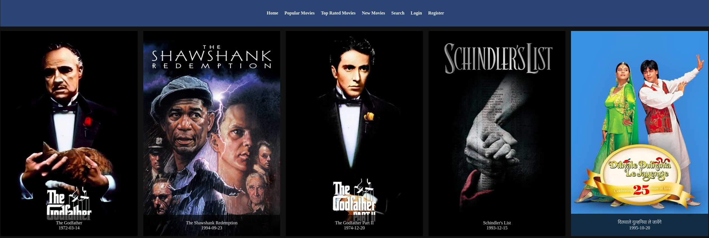
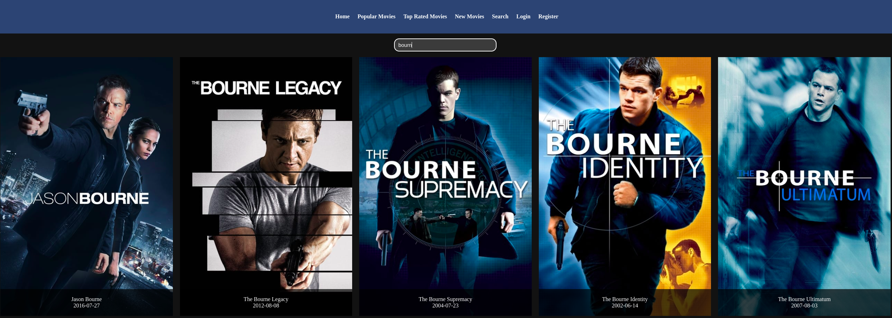

# Movies React


## Descripción del proyecto.

Este proyecto es un sitio web desarrollado con React y Vite que permite realizar consultas de películas utilizando la API de "The Movie DB" mediante la API de "The Movie DB".
El sitio web está compuesto por una web de portada y un menú que da acceso a las siguientes páginas:

- Lista de las películas más importantes
- Lista de películas nuevas
- Lista de películas mejor puntuadas
- Búsqueda de películas por título

Los resultados se muestran presentando las portadas de las películas y sobre estas su título y fecha. Cuando pulsamos sobre una de las películas se accede a otra web en la que vemos la portada y más información sobre la película, como el título, puntuación, fecha, descripción, etc.

## Capturas de Pantalla





## Características

- Consulta de películas por categoría: más importantes, nuevas, mejor puntuadas.
- Búsqueda de películas por título.
- Detalles de película que incluyen título, puntuación, fecha, descripción, etc.

## Tecnologías Utilizadas

- React
- Vite
- CSS
- HTML
- JavaScript

## Instalación

Sigue estos pasos para instalar y ejecutar la aplicación:

1. Clona el repositorio: `git clone https://github.com/tu-usuario/movies-react.git`
2. Entra al directorio del proyecto: `cd movies-react`
3. Instala las dependencias: `npm install`
4. Inicia la aplicación: `npm run dev`
   Esto abrirá el proyecto en tu navegador en la dirección http://localhost:[puerto] con la que poder acceder al sitio web.

## Uso

Una vez que el sitio web es accesible a través de un navegador se podrán acceder a los diferentes apartados mediate el menú superior seleccionando la opción deseada.
La opción de búsqueda ofrece la posibilidad de buscar una película. Irán apareciendo resultados alrededor de medio segundo al parar de escribir en el campo de búsqueda.
Al pulsar sobre cualquiera de los resultados se accederá a la información más detallada de la película seleccionada.

## Estructura del Proyecto

```plaintext
.
├── index.html
├── package.json
├── package-lock.json
├── public
│   ├── popcorn.svg
│   └── video.mp4
├── README.md
├── README_test.md
├── src
│   ├── App.css
│   ├── App.jsx
│   ├── assets
│   │   └── react.svg
│   ├── common
│   │   ├── ButtonNav
│   │   │   ├── ButtonNav.css
│   │   │   └── ButtonNav.jsx
│   │   ├── CustomInput
│   │   │   ├── CustomInput.css
│   │   │   └── CustomInput.jsx
│   │   └── header
│   │       ├── Header.css
│   │       └── Header.jsx
│   ├── index.css
│   ├── main.jsx
│   ├── pages
│   │   ├── body
│   │   │   └── Body.jsx
│   │   ├── home
│   │   │   ├── Home.css
│   │   │   └── Home.jsx
│   │   ├── login
│   │   │   ├── Login.css
│   │   │   └── Login.jsx
│   │   ├── movie
│   │   │   ├── Movie.css
│   │   │   └── Movie.jsx
│   │   ├── movies
│   │   │   ├── MoviesB.css
│   │   │   ├── Movies.css
│   │   │   └── Movies.jsx
│   │   ├── newmovies
│   │   │   ├── NewMovies.css
│   │   │   └── NewMovies.jsx
│   │   ├── register
│   │   │   ├── Register.css
│   │   │   └── Register.jsx
│   │   ├── search
│   │   │   ├── Search.css
│   │   │   └── Search.jsx
│   │   └── topmovies
│   │       ├── TopMovies.css
│   │       └── TopMovies.jsx
│   └── services
│       ├── apiCalls.js
│       └── useful.js
└── vite.config.js
```

## Contribuciones

Si deseas contribuir a este proyecto, sigue estos pasos:

1. Haz un fork del proyecto.
2. Crea una rama para tu contribución: `git checkout -b feature/nueva-funcionalidad`
3. Realiza tus cambios y haz commit: `git commit -m 'Agrega nueva funcionalidad'`
4. Haz push a tu rama: `git push origin feature/nueva-funcionalidad`
5. Crea una solicitud de extracción (pull request) en GitHub.

## Licencia

Este proyecto está bajo la licencia [MIT](LICENSE).

## Ejemplos

A continuación se muestran algunos ejemplos de cómo usar el proyecto:

Para ver la lista de las películas más importantes, visita la página /important.
Para ver la lista de películas nuevas, visita la página /newest.
Para ver la lista de películas mejor puntuadas, visita la página /top-rated.
Para buscar películas por título, visita la página /search e introduce el título de la película en el campo de búsqueda.
Cuando pulsas sobre una película en la lista de resultados, se abrirá una nueva página con más información sobre la película.

---

¡Gracias por tu interés en Movies React! Si tienes alguna pregunta o problema, no dudes en crear un [issue](link_to_your_issues_page).
